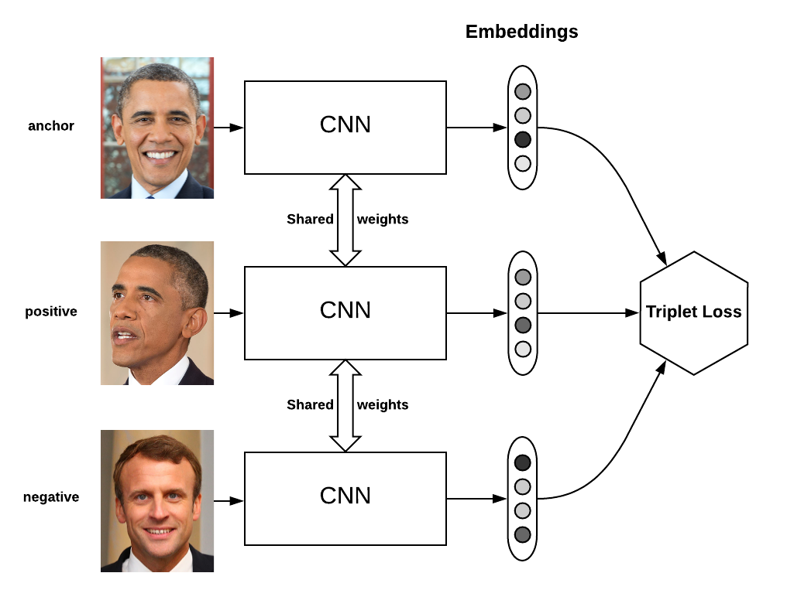
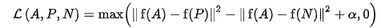
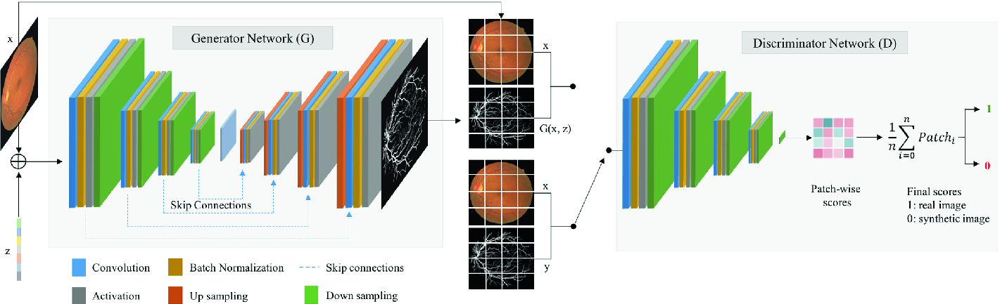
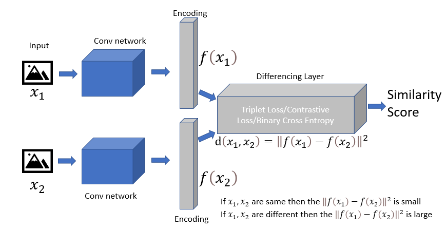

# Counterfeit detection using one shot learning
## Introduce
This is a competition organized by Cypheme. I just found this part very interesting, so I decided to make this README to share how I worked on this project, my ideas, results, also how to run my code.


## Some observations & brainstorming:
- About 13000 pair of images. The purpose is to verify if photos in "img" correspond to photos in "scan". Output is 1 if "img" photo and "scan" photo are in the same class else 0.
- Some ideas to solve this:
    - Extract embedding of a pair of photos. Then compare these 2 embeddings: If distance of 2 embeddings > Threshold --> not match else match. To extract embeddings, I have 2 ideas for this solution:
        - Train a siamese network by triplet loss. Anchor will be photos in "img", positive will be the phots of same id in "scan", negative will be sampled from all the rested id. At inference time, this network will be used to extract embedding and compare the distance between 2 embeddings with a threshold.
        - Train a GAN which can perfectly reconstruct "scan" photo from "img" photo. If "scan" and "img" are not in the same class, the generated photo from "img" must be very different from "scan" photo. At inference time, input "img" photos and compare generated photos with "scan" photo using ecleudian distance. If distance > threshold --> not match.
    - One shot learning. This solution is quite natural if we look at training dataset. Each class we have 1 example and we have a lot of classes. For this approach, I was thinking of 2 possible techniques: siamese network and meta learning.
        - As above, siamese network is natural: input 2 images, generate embedding, and find if these embeddings are similar. 
        - Meta learning: Some meta learning technique is very efficient for One shot learning : MANN, MAML, especially MAML. But due to the limited time of this project, and the limitation of computational ressource, I just "laisser tomber" this idea.
- So what strategy for these whole ideas ? I have 2 days and I really have good feelings for one shot learning because I've had already have some notions of this problematic (with Meta learning). But I also really want to test the ideas of siamese network with triplet loss and GAN to see how they can go, and maybe I could find something interesting. So I decided to use the first day on the idea of embedding extraction, and the seconde day for one shot learning.

Now, it's time to test our ideas.

## Embedding extraction with siamese network with triplet loss and GAN
### 1. Embedding extraction with siamese network with triplet loss

A classical design is used for this project. I use photos in "img" as anchor, "scan" of the same ID for positive, random from other "scan" as negative. The idea of triplet loss is to make distance between anchor and positive as small as possible while making distance between anchor and negative largest.

CNN's weights are shared between anchor, positive and negative. I simply reuse some very successful CNN model (vgg, resnet, efficientnet, ...) with pretrained weights on ImageNet. All of theses models are supported by Tensorflow 2.5.

After 1 hour of coding and organize my code, I began to train the siamese network. This network doesn't have many hyper-parameters to fine-tune, so I really focus on learning rate. I found that model converged much faster with small learning rate (1e-5 to 3e-5). Data augmentation is applied to positive sample because anchor always see only 1 positive image (only 1 "scan" per ID) but can see a lot of different negative images. Without data augmentation, network can simply "memorize" the positive and learn nothing.

After a lot of hours of fine tuning, I submitted my first submission and got 0.49. Not good, but not the worst for the first submission (trust me, I've got 0.03 on first submission for another competition). Except, all my predictions are 1. It means that my model always see similar pair of photos. It's not normal because the validation triplet loss converged to very low value. So just look at formulate of triplet loss.



I found that my model didn't try to make the distance between anchor and positive sample smallest and to make the distance between anchor and negative sample largest. The model just tried to make these 2 distances closed, and make distance between anchor and positive smaller than distance between anchor and negative to get 0 of loss. I tried to vary the alpha and to put a weight to the distance between anchor and positive to force the model to minimize this distance, but it didn't work. 

I used other few hours to change the CNN, but that didn't make it better. So I decided not to spend more time on this idea, but move to the next idea of GAN. 

### 2. Embedding extraction with GAN



So my idea is input a photo from "img" to an autoencoder to generate the photo much similar as photo of the same ID from "scan" as possible. This autoencoder is called Generator(G). I have a small CNN trying to recognize the generated (fake) photo and the "scan" photo. These 2 models are trained simultaneously as described in (1).

At inference time, I use Generator to generate a photo from "img" photo. The idea is that if we have a perfect Generator, it can generate the true "scan" photo from the real "img" photo. And if the Generator sees a fake Cypheme label, it will generate a new photo which is very different from correspondant "scan" photo. To evaluate similarity of 2 photos, I used L1 distance.

This time I didn't have to code from the begining because I've already done this kind of model before. With some modification, the code ran perfectly.

I trained and than submitted the new result: 0.71. Really impressive comparing with the previous time. I thought that I found something new here. So I tried to visualize generated photos of training dataset. The generated photos recreated perfectly the "scan" images, except the most important part: unique chemical signature. There was no visible pattern of this signature part in generated photos, all was noise. I tried then to visualize the distribution of L1 distance between generated photos and "scan" photos. I found that I was lucky because I choose accidentally the threshold that worked for this model and this dataset. Furthermore, the generated photos were perfect at background and all other edges, L1 distance was small. And because Generator couldn't generate the most important part of photo (chemical signature), I can't count on this model.

I tried a little bit more with some other hyper-parameters, or with filtering the background of photos using provided masks before training. But nothing worked. So I moved to the next idea: one shot learning.


## One Shot Learning



So this is basically my idea. Use a convolution network to generate embeddings of 2 input images, calulate distance between them and use a fully connected layer with sigmoid activation to output similarity score. This is similar as (2).

As in the first idea of using siamese network to extract embedding, I used some familiar CNN like vgg, resnet, mobilenet, effnet for the feature extraction. But this time, we don't have triplet loss, so our input is changed. One input now is a pair of image, and output is their similarity score.

Our problem now can be formulated as an one shot learning problem: we have number of IDs as number of classes, each class has only one training sample ("scan"). For each mini-batch of batch_size K, we generates K/2 positive pairs of photos, which means 2 photos in these pair are the same class (same ID, 1 photo from "img", 1 photo from "scan"), and rested K/2 negative pairs of photos (different ID, 1 photo from "img", 1 photo from "scan"). Label for positive pairs is 1, and 0 for negative pairs. So we reform our problem as classification problem.

At inference time, we take as input 2 photos (1 from "img" and 1 from "scan"). Base on similarity score, we can decide that the pair is similar or not.

Like other classification problems, cross entropy is used as loss function. Accuracy is my metric. Some other researchs prefer accuracy of K-way 1-shot test as metric, but I used accuracy to have a same metric as Kaggle and so a better estimation of test evaluation result.

I tried some first few train with EfficientnetB0 as backbone without any data augmentation,  regularization or preprocessing and submitted the result. I got 0.81. No lucky this time because the model performed well when I visualized some examples.

When I visualized on my validation set, I found that some errors came from the quality of "img" photos: they were too blurry. Because we only care about pattern of chemical signature to verify the Cypheme label, it's natural that we detect edges in photos before feeding them to model. So edge detection by Sobel was used as preprocessing method.

With Sobel preprocessing, the model is much more overfitting. So I added L2 regularization and some soft data augmentation to model. Observing the training and validation loss, I found that theses 2 losses were really closed. So maybe the capacity of model was not enough to capture all the feature of dataset. So I decided to use a more powerful backbone: EfficientNetB4. EfficientNetB4 and EfficientNetB0 have actually the same kind of building block, but they have different scale in resolution, depth and width. The train was quite slow because I don't have a really good GPU, and the model moved quite slowly. At the end, I found a model with 0.88 as accuracy on test set. I think that the performance can still be improved if I increase a little bit of capacity of model if I could have a better computational ressource (and time of course).

I also tried to filter the background of photos using provided masks but it didn't work.

At this time, I decided to go to sleep and when I woke up, I had a thought about using ResNet instead of EfficientNet because EfficientNet is a powerfull model but hard to train without strong regularization. So I changed from EfficientNet to Resnet. At this moment I only have 4 hours to fine tune new models. I did the same test as EfficientNet, with and without edge processing ad mask filtering. And I was right. Resnet is much more easy to train and I got the same performance of Efficientnet really quickly without any data augmentation and preprocessing. I got the new MVP now. It was quite pity that I didn't have much time left to carefully finetune this model. 


## Conclusion

With one shot learning, I got 0.88 on test set. This result can be improved if there was more time to carefully finetune the hyper-parameters on the ResNet.

Trying on 3 ideas in 2 days was a bit greedy and quite tough for the timing, but it's never wasted to try something new in competitions.


## Reference
(1): Goodfellow, I., 2016. Nips 2016 tutorial: Generative adversarial networks. arXiv preprint arXiv:1701.00160

(2): Koch, G., 2015, ICML 2015: Siamese Neural Networks for One-shot Image Recognition


## How to run this repo
- Build docker image used for this project
```
docker build docker/ -t counterfeit
```
The docker image will be built with all necessary dependencies for the training and inference. 

- Next, use nvidia-docker to open the container

```
nvidia-docker run -it --rm -v ~/projects/one-shot-learning/:/workspace
cd ../workspace
```
- Run the training script

```
python train.py model_name path_to_scan_folder path_to_img_folder path_to_save_checkpoint batch_size gpu_id
```

example:
```
python train.py resnet101 data/train/scan data/train/img checkpoint/resnet101 4 0
```

model_name can be one of these models: vgg16, vgg19, resnet50, resnet101, resnet152, mobilenet, mobilenetv2, efficientnetb0, efficientnetb1, ..., efficientnetb7. 

You all need to modify some option of data generator in train.py:
- preprocess : 'rgb' or 'sobel'. Data generator will read image in 'rgb' if preprocess='rgb' or it will use 'sobel' to detect the edge in images before training.
- filter: True if you want to filter out the backgrounds in images when training.

Maybe you want to change the callback in train.py to save only the best model.

- Run inference script
```
python test.py path_to_checkpoint path_to_test_scan path_to_test_img --use-mask --edge
```
Use --use-mask if you want to use masks to filter the background.

Use --edge if you want to preprocess by edge detection. These two options depend on how you train model.

This script outputs a submission file in csv for kaggle.
